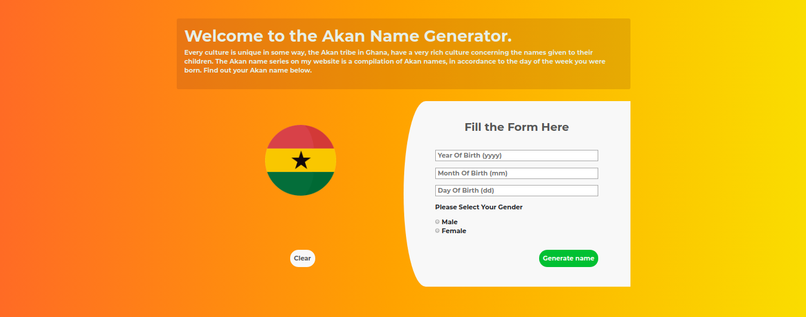
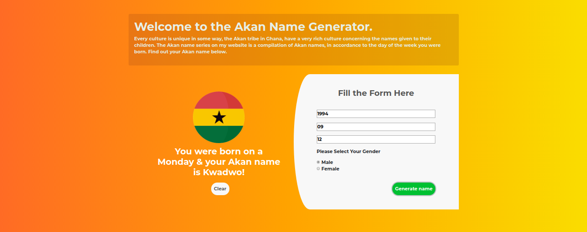

# Akan Name Generator.
#### Generates names, of the Akan tribe in accordance to the day of the week you were born, 18/08/2019.
#### By **Isaac Gichuru**

## Description
This is a web application that takes your birthday details and calculates the day of the week you were born and then depending on your gender, generates an Akan tribe name. In Ghanian culture, children are given their first name as a 'day name' which corresponds to the day in the week they were born.
## Behaviour Driven Development (BDD)
|Behaviour 	           |    Input 	                 |       Output          |
|----------------------------------------------|:-----------------------------------:|-----------------------------:|       
|Page loads and  a form displayed                         |   User enters form details  and selects from the select radios   and clicks submit                   |Their Akan name is displayed     |                       |

## Setup/Installation Requirements
Here is a run through of how to set up the application:
* Step 1 : Clone this repository using the git clone link:
  * **`git clone https://github.com/Isaacg94/akan-name-generator.git`**

* Step 2 : Navigate to the directory:
  * **`cd akan-name-generator`**

* Step 3 : Open the directory created with your favorite IDE. If Atom type **`atom .`** if VSCode type **`code .`** . This will lauch the editor with the project setup,

* Now feel free to hack around the project.

## Technologies Used
* HTML
* CSS
* Javascript

## Support and contact details
Primary E-mail Address: 7248zack@gmail.com
### License
*MIT License*

Copyright (c) 2019 **Isaac Gichuru**
